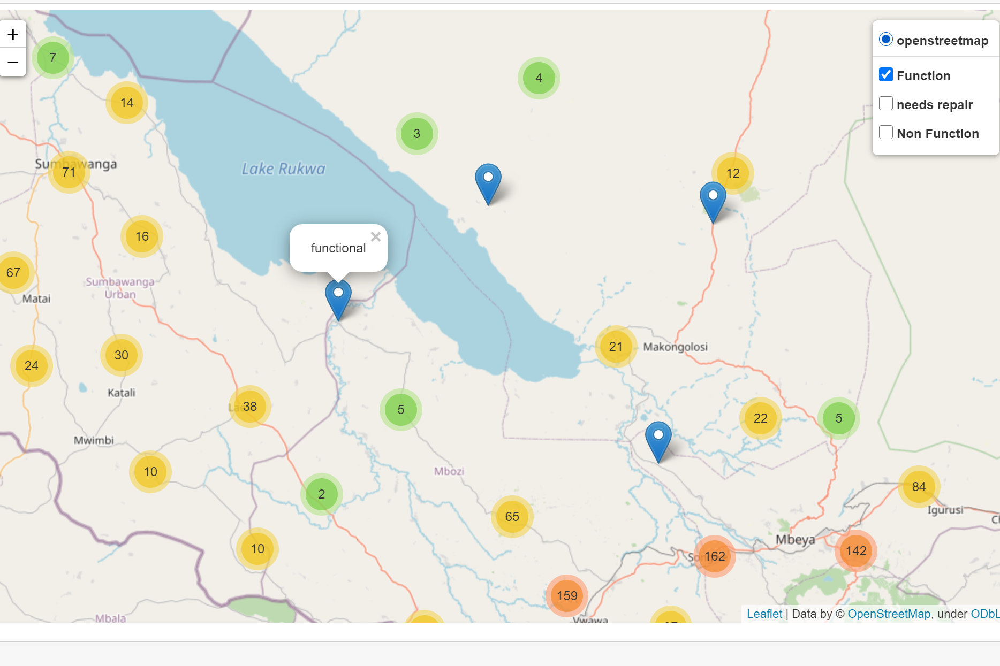

# Project : Data Science Classification Problem
# Detect faluty water pumps in Tanzania

The objective of this project: To pridect which water pumps are functional, which need some repairs, and which don't work by using given dataset from the competition platform. [Here to find out more about the project report](), which contains below. 

1. The objecttive of this project
2. Data details
3. Domain 
4. Exploring and cleaning data
5. Feature engneering
6. Modeling and evaluation
7. Challenges and augmentations

[See interactive folium map ]()

**5600 competitors** joined and the best public score (30 Oct 2020) is **0.8294**. **My private score is 0.87.** [the website of the competion](https://www.drivendata.org/competitions/7/pump-it-up-data-mining-the-water-table/page/23/)

# Motivation

Interested in processing **geospatial data** and taking my understandings to a next level to deepen data science knowledge and skills. This problem has both categorical and numeric features, and multi-labels. This project spotlights **data visualisaiton** as well as **preprocessing and modeling**. 

# Files' and folders' descriptions
* [findings]() **The project folder**
  - [analysis.md]() **The summary and details of this project.**
* [data]() A data folder containing raw and processed data files
* [image]() Images' folder used for [analysis.md]()
* [model]() A folder of a picked model
* [utils]() Utils folder for data cleaning, feature engneering and resampling. 
  - [cleaning_data_utils.py]() 
  - [feature_engneering_utils.py]()
  - [resampling_utils.py]()
* [requirements.txt]() Software Requirements

* [folium_map_layercontrol.ipynb]() **Interactive water pumps' maps of Tanzania** in python notebook by using folium and geospatial data.
* [basemap.py]() Maps plotted by basemap
* [data_visualisation.ipynb]() Data visualisation codes and images in python notebook
* [cleaning_data.py]() Data cleaning and feature engneering.
* [resampling.py]() Impliment a resampling technique.
* [modeling.py]() Building models.
* [modeling_gridsearch.py]() Turning XGBoost model's parameters and it generates cross validation score.

  

  
  
  
  
  
  
  
  
  
  
  
  
  
  
  
  
  
  
  
  
  
  
